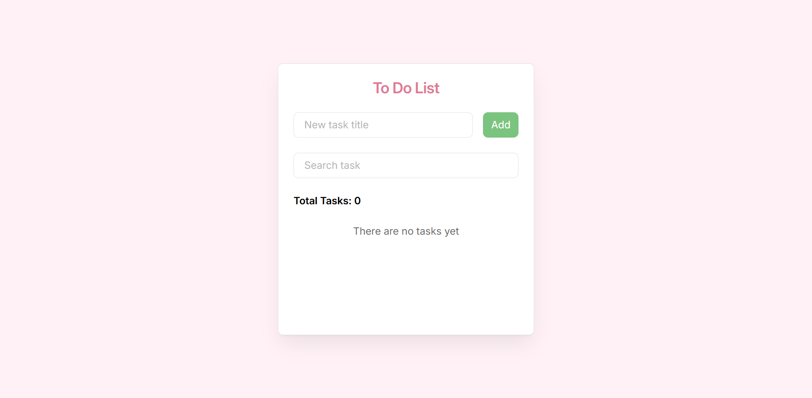
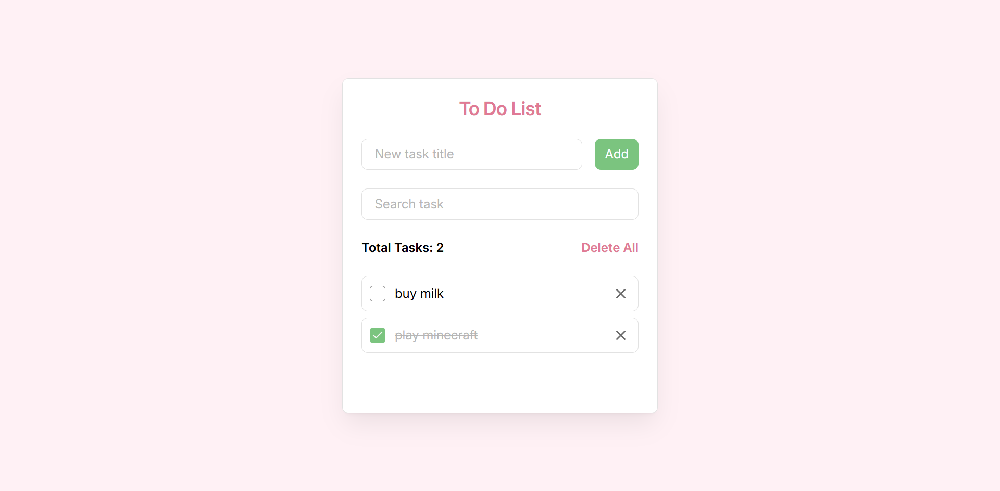
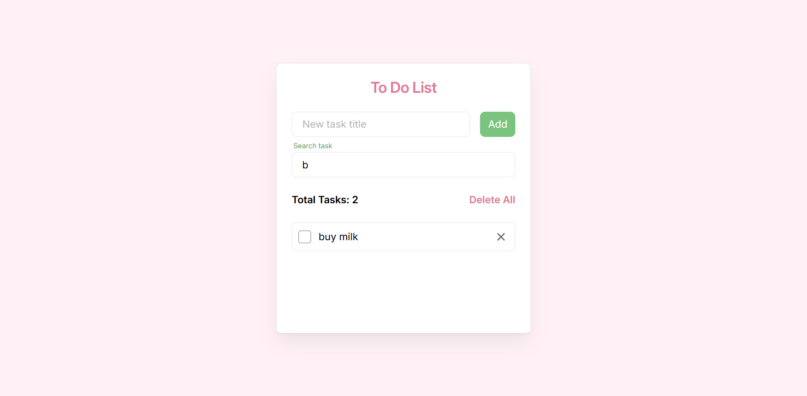

# ✅ To-Do List App

Simple and clean task management application.
Built with focus on core frontend logic, state management and user interaction.

🔗 **Live Demo:** https://marygeraska.github.io/to-do-list/


## Preview






## Features

* Add new tasks
* Mark tasks as completed
* Delete tasks
* Search tasks
* LocalStorage persistence
* Clean and responsive UI
* Instant UI updates


## Tech Stack

* JavaScript 
* CSS
* LocalStorage API


## What I focused on

* State management
* Component logic
* User interaction (UX)
* Data persistence in browser
* Clean and readable code


## Setup

1. **Clone the repository**:
   ```bash
   git clone https://github.com/marygeraska/to-do-list.git
   ```

2. **Go to the project folder:**
    ```bash
    cd to-do-list
    ```

3. **Install dependencies:**
    ```bash
    npm install
    ```

4. **Run the project:**
    ```bash
    npm run dev
    ```


## 🇷🇺 Краткое описание

Простое приложение для управления задачами.

Функционал:

* добавление задач
* отметка выполненных
* поиск задач
* удаление
* сохранение в localStorage

Проект демонстрирует базовые навыки работы с состоянием, логикой и пользовательским взаимодействием.
